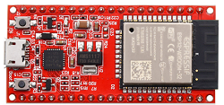
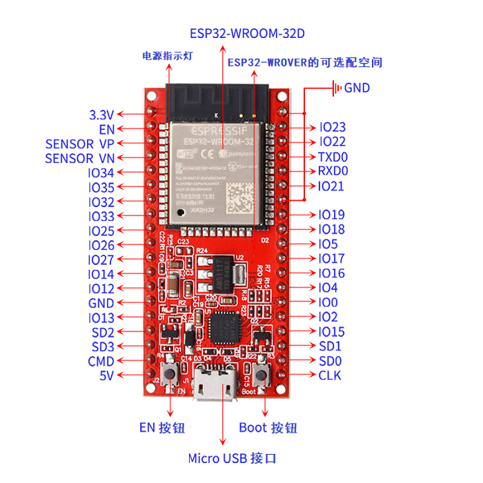
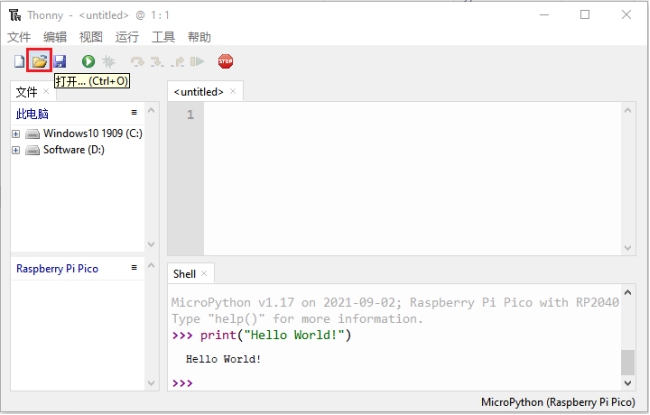
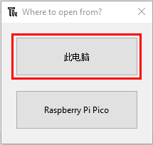
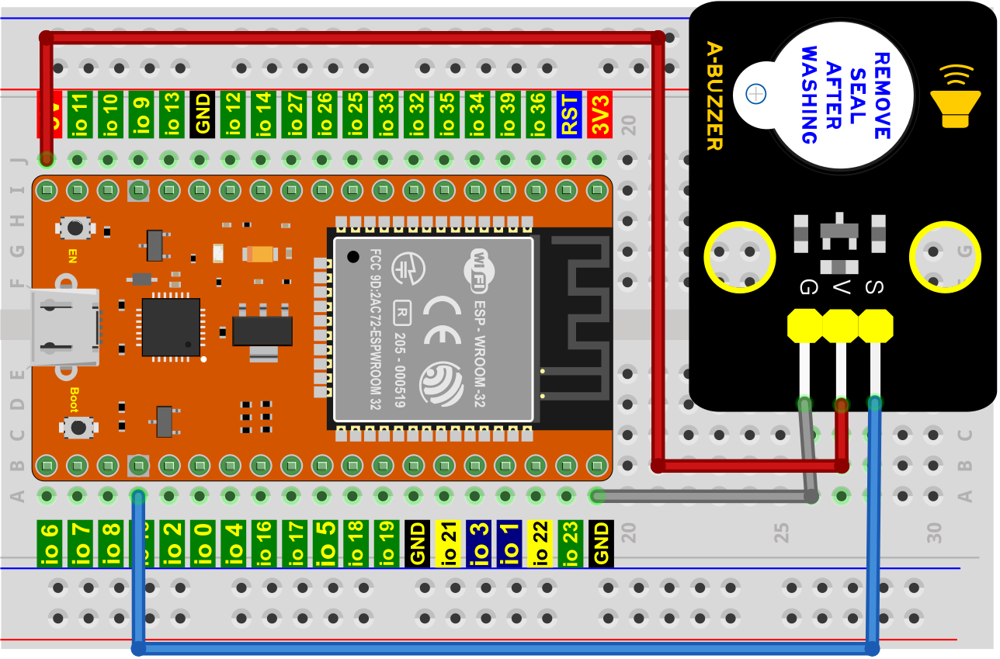
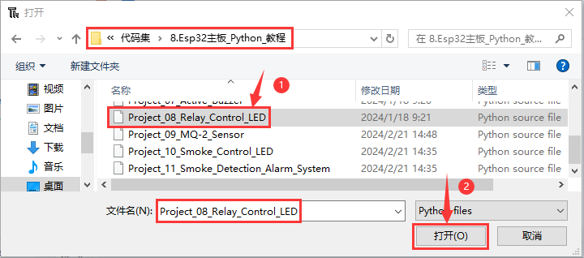
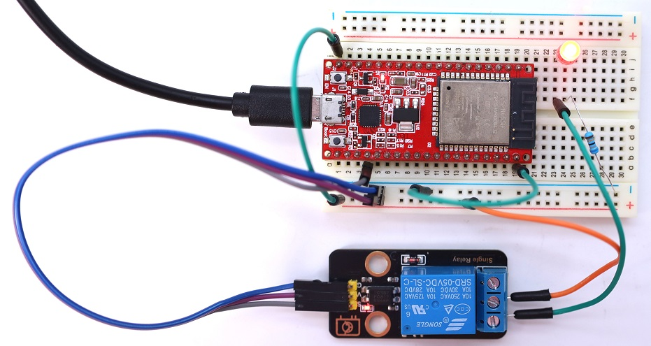
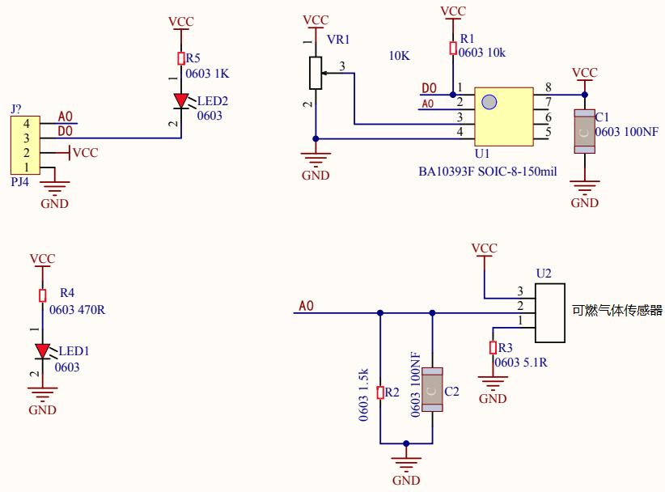
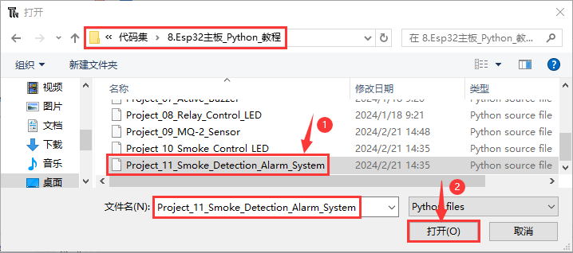

# Esp32主板_Python_教程

## 1. Esp32主板：



---

1. 简介:

在我们开始学习keyes 烟雾检测套件之前，首先介绍keyes ESP32 主控板，它是所有项目的核心。

keyes ESP32主板是基于ESP-WROOM-32模块所设计的的迷你开发板。该开发板引出大部分I/O至两侧的2.54mm间距的排针，开发者可以根据自己的需求连接外设。使用开发板进行开发和调试时，两侧的标准排针可以让你的操作更加简洁方便。

ESP-WROOM-32模块是业内集成度领先的 WiFi + 蓝牙解决方案，外部元器件少于 10 个，它集成了天线开关、射频 balun、功率放大器、低噪放大器、过滤器和电源管理模块。同时，它也集成了天采用 TSMC 低功耗 40nm 技术，功耗性能和射频性能，安全可靠，易于扩展至各种应用。

---

2. 规格参数:

微控制器: ESP-WROOM-32模块

USB转串口芯片: CP2102-GMR

工作电压:	DC 5V

工作电流：80mA（平均）

供电电流：500mA（最小）

工作温度范围: -40°C ~ +85°C 

WiFi模式：Station/SoftAP/SoftAP+Station/P2P

WiFi协议：802.11 b/g/n/e/i（802.11n，速度高达 150 Mbps

WiFi频率范围：2.4 GHz ~ 2.5 GHz

蓝牙协议：符合蓝牙 v4.2 BR/EDR 和 BLE 标准

尺寸：55x26x13mm

重量：9.8g

---

3. 各个接口和主要元件说明:




---

4. 各个接口详细说明:

- IO23: VSPI MOSI/SPI MOSI
- IO22: Wire SCL
- TXD0: IO1/Serial TX
- RXD0: IO3/Serial RX
- IO21: Wire SDA
- IO19: VSPI MISO/SPI MISO
- IO18: VSPI SCK/SPI SCK
- IO5: VSPI SS/SPI SS
- IO4: ADC10/TOUCH0
- IO0: ADC11/TOUCH1
- IO2: ADC12/TOUCH2
- IO15: HSPI SS/ADC13/TOUCH3/TDO
- SD1: IO8/FLASH D1
- SD0: IO7/FLASH D0
- CLK: IO6/FLASH SCK
- CMD: IO11/FLASH CMD
- SD3: IO10/FLASH D3
- SD2: IO9/FLASH D2
- IO13: HSPI MOSI/ADC14/TOUCH4/TCK
- IO12: HSPI MISO/ADC15/TOUCH5/TDI
- IO14: HSPI SCK/ADC16/TOUCH6/TMS
- IO27: ADC17/TOUCH7
- IO26: ADC19/DAC2
- IO25: ADC18/DAC1
- IO33: ADC5/TOUCH8
- IO32: ADC4/TOUCH9
- IO35: ADC7
- IO34: ADC6
- SENSOR VN: IO39/ADC3
- SENSOR VP: IO36/ADC0
- EN 按钮: 复位键

---

## 2. Thonny IDE 的下载、安装和使用方法

参考链接：[http://wikikeyes-thonny.readthedocs.io/](http://wikikeyes-thonny.readthedocs.io/)

<span style="color: rgb(255, 76, 65);">注意：</span><span style="background:#ff0;color:#000">Esp32主板_Python_教程使用的是ESP32-Thonny IDE 的下载、安装和使用方法。</span>

---

## 3. 课程

---

项目01 Hello World

1. 项目介绍：

对于ESP32的初学者，先从一些简单的开始学习吧！在这个项目中，你只需要一个ESP32主板，MicroUSB线和计算机就可以完成“Hello World!”项目。它不仅是ESP32主板和计算机的通信测试，也是ESP32的初级项目。这也是一个入门实验，让你进入计算机的编程世界。

2. 项目元件：

| |  |
| :--: | :--: |
|ESP32主板*1 | MicroUSB线*1 |

3. 项目接线：


4. 在线运行代码：

要在线运行ESP32，你需要把ESP32主板连接到电脑上。这样就可以使用Thonny软件编译或调试程序。

**优点：** 1. 你们可以使用Thonny软件编译或调试程序。

2. 通过“Shell”窗口，你们可以查看程序运行过程中产生的错误信息和输出结果，并可以在线查询相关功能信息，帮助改进程序。

**缺点：** 1.要在线运行ESP32，你必须将ESP32主板连接到一台电脑上并和Thonny软件一起运行。

2.如果ESP32主板与电脑断开连接，当它们重新连接时，程序将无法再次运行。


**<span style="color: rgb(255, 76, 65); font-size: 24px;">特别注意：</span>本教程中使用的代码保存的路径为：“...\代码集\8.Esp32主板_Python_教程”中。**

<br>

<span style="color: rgb(255, 169, 0);">**基本操作：**</span>
<br>

1.打开Thonny软件，并且单击“**打开...**”。



2.在新弹出的窗口中，点击“**此电脑**”。



3.在新的对话框中，选中“Project_01_HelloWorld.py”,单击“**打开**”。


```Python
print("Hello World!")
print("Welcome to Keyestudio")
```

5. 项目现象：
 
利用MicroUSB线连接到计算机上电，单击来执行程序代码。代码开始执行，你会看到的现象是：“Shell”窗口打印出“Hello World!”、“Welcome to Keyestudio”。


当在线运行时，单击或按Ctrl+C退出程序。

---

项目02 点亮LED

1. 项目介绍：

在这个项目中，我们将向你展示点亮LED。我们是使用ESP32主板的数字引脚来打开LED，使LED被点亮。

2. 项目元件：

||||
| :--: | :--: | :--: |
|ESP32主板*1|面包板*1|红色LED*1|
|| ||
|220Ω电阻*1|面包板连接线*2|MicroUSB线*1|

3. 元件知识：

**（1）LED**


LED是一种被称为“发光二极管”的半导体，是一种由半导体材料(硅、硒、锗等)制成的电子器件。它有正极和负极。短腿为负极，接GND，长腿为正极，接3.3V或5V。


**（2）五色环电阻**

电阻是电路中限制或调节电流流动的电子元件。左边是电阻器的外观，右边是电阻在电路中表示的符号。电阻(R)的单位为欧姆(Ω)，1 mΩ= 1000 kΩ，1kΩ= 1000Ω。


我们可以使用电阻来保护敏感组件，如LED。电阻的强度（以Ω为单位）用小色环标记在电阻器的主体上。每种颜色代表一个数字，你可以用电阻对照卡查找。


在这个套件中，我们提供了2个具有不同电阻值的五色环电阻。这里以2个五色环电阻为例：

220Ω电阻×10


1KΩ电阻×10


在相同的电压下，会有更小的电流和更大的电阻。电流、电压、电阻之间的联系可以用公式表示：I=U/R。在下图中，目前通过R1的电流: I = U / R = 3 V / 10 KΩ= 0.0003A= 0.3mA。


不要把电阻值很低的电阻直接连接在电源两极，这样会使电流过高而损坏电子元件。电阻是没有正负极之分。

**（3）面包板**

面包板是实验室中用于搭接电路的重要工具。面包板上有许多孔，可以插入集成电路和电阻等电路元件。熟练掌握面包板的使用方法是提高实验效率，减少实验故障出现几率的重要基础之一。下面就面包板的结构和使用方法做简单介绍。一个典型的面包板如下所示：


面包板的外观和内部结构如上图所示，常见的最小单元面包板分上、中、下三部分，上面和下面部分一般是由一行或两行的插孔构成的窄条，中间部分是由中间一条隔离凹槽和上下各5 行的插孔构成的条。


在面包板的两个窄条分别有两行插孔，两行之间是不连通的，一般是作为电源引入的通路。上方第一行标有“+”的一行有10组插孔（内部都是连通），均为正极；上方第二行标有“-”的一行有10组插孔，（内部都是连通），均为接地。面包板下方的第一行与第二行结构同上。如需用到整个面包板，通常将“+”与“+”用导线连接起来，“-”与“-”用导线连接起来。

中间部分宽条是由中间一条隔离凹槽和上下各5 行的插孔构成。在同一列中的5 个插孔是互相连通的，列和列之间以及凹槽上下部分则是不连通的。外观及结构如下图：


中间部分宽条的连接孔分为上下两部分，是面包板的主工作区，用来插接原件和面包板连接线。在同一列中的5个插孔（即a-b-c-d-e，f-g-h-i-j）是互相连通的；列和列之间以及凹槽上下部分是不连通的。在做实验的时候，通常是使用两窄一宽组成的小单元，在宽条部分搭接电路的主体部分，上面的窄条取一行做电源，下面的窄条取一行做接地。中间宽条用于连接电路，由于凹槽上下是不连通的，所以集成块一般跨插在凹槽上。

**(4)电源**

ESP32主板需要3.3V-5V电源，在本项目中，我们通过用MicroUSB线将ESP32主板和电脑连起来。


4. 项目接线图：


5. 在线运行代码：

**<span style="color: rgb(255, 76, 65); font-size: 24px;">特别注意：</span>本教程中使用的代码保存的路径为：“...\代码集\8.Esp32主板_Python_教程”中。**

<br>

1.打开Thonny软件，并且单击“**打开...**”。


2.在新弹出的窗口中，点击“**此电脑**”。


在新的对话框中，选中“Project_02_Turn_On_LED.py”,单击“**打开**”。


```Python
from machine import Pin
import time

led = Pin(15, Pin.OUT)   # 创建引脚GPIO15为LED对象，设置引脚GPIO15为输出模式

while True:

    led.value(1)    # led点亮

```

6. 项目现象：

按照接线图正确接好模块，利用MicroUSB线连接到计算机上电，单击来执行程序代码。代码开始执行，你会看到的现象是：LED被点亮。


当在线运行时，单击或按Ctrl+C退出程序。


7. 代码说明:

| 代码                    | 说明                                                         |
| ----------------------- | ------------------------------------------------------------ |
| from machine import Pin | machine模块里对ESP32主板的一些配置等已经设置好了，我们需导入它，然后调用。 |
| led = Pin(15, Pin.OUT)   | 构建一个引脚类实例，我们将其命名为led，15表示我们连接的引脚为GPIO15，Pin.OUT表示引脚15为输出模式，即可以使用value()方法输出高电平(3.3V) ：led.value(1)，或者低电平(0V) ：led.value(0)。 |
| while True:             | 循环函数，在此函数下面的语句循环执行，除非True变False。      |

---

项目03 LED闪烁

1. 项目介绍：

在这个项目中，我们将向你展示LED闪烁效果。我们是使用ESP32主板的数字引脚来打开LED，让它闪烁。

2. 项目元件：

||||
| :--: | :--: | :--: |
|ESP32主板*1|面包板*1|红色LED*1|
|| ||
|220Ω电阻*1|面包板连接线*2|MicroUSB线*1|

3. 项目接线图：


4. 在线运行代码：

**<span style="color: rgb(255, 76, 65); font-size: 24px;">特别注意：</span>本教程中使用的代码保存的路径为：“...\代码集\8.Esp32主板_Python_教程”中。**

<br>


1.打开Thonny软件，并且单击“**打开...**”。


2.在新弹出的窗口中，点击“**此电脑**”。


在新的对话框中，选中“Project_03_LED_Blinking.py”,单击“**打开**”。


```Python
from machine import Pin
import time

led = Pin(15, Pin.OUT)   # 创建引脚GPIO15为LED对象，设置引脚GPIO15为输出模式

try:
    while True:
        led.value(1)    # LED点亮
        time.sleep(0.5) # 延时 0.5秒
        led.value(0)    # LED熄灭
        time.sleep(0.5) # 延时 0.5秒
except:
    pass
```

5. 项目现象：

按照接线图正确接好各元器件，利用MicroUSB线连接到计算机上电，单击来执行程序代码。代码开始执行，你会看到的现象是：LED闪烁。


当在线运行时，单击或按Ctrl+C退出程序。


6. 代码说明:

| 代码                    | 说明                                                         |
| ----------------------- | ------------------------------------------------------------ |
| from machine import Pin | machine模块里对ESP32主板的一些配置等已经设置好了，我们需导入它，然后调用。 |
| led = Pin(15, Pin.OUT)   | 构建一个引脚类实例，我们将其命名为led，15表示我们连接的引脚为GPIO15，Pin.OUT表示引脚15为输出模式，即可以使用value()方法输出高电平(3.3V) ：led.value(1)，或者低电平(0V) ：led.value(0)。 |
| while True:             | 循环函数，在此函数下面的语句循环执行，除非True变False。      |
| time.sleep(0.5)           | time模块主要是用于时间延迟设置。括号里是0.5，延时0.5秒。         |

---

项目04 交通灯

1. 项目介绍：

交通灯在我们的日常生活中很普遍。根据一定的时间规律，交通灯是由红、黄、绿三种颜色组成的。每个人都应该遵守交通规则，这可以避免许多交通事故。在这个项目中，我们将使用ESP32主板和一些led(红，黄，绿)来模拟交通灯。

2. 项目元件：

|||||
| :--: | :--: | :--: |:--: |
|ESP32主板*1|面包板*1|红色LED*1|黄色LED*1|
||| ||
|绿色LED*1|220Ω电阻*3|面包板连接线若干|MicroUSB线*1|

3. 项目接线图： 


4. 在线运行代码：

**<span style="color: rgb(255, 76, 65); font-size: 24px;">特别注意：</span>本教程中使用的代码保存的路径为：“...\代码集\8.Esp32主板_Python_教程”中。**

<br>


1.打开Thonny软件，并且单击“**打开...**”。


2.在新弹出的窗口中，点击“**此电脑**”。


在新的对话框中，选中“Project_04_Traffic_Lights.py”,单击“**打开**”。


```Python
from machine import Pin
import time

led_red = Pin(0, Pin.OUT)  # 创建引脚GPIO0为红色led对象，设置引脚GPIO0为输出模式
led_yellow = Pin(2, Pin.OUT)  # 创建引脚GPIO2为黄色led对象，设置引脚GPIO2为输出模式
led_green = Pin(15, Pin.OUT) # 创建引脚GPIO15为绿色led对象，设置引脚GPIO15为输出模式
while True:
    led_green.value(1)  # 设置绿色led灯亮
    time.sleep(5)   # 延时 5秒
    led_green.value(0) # 设置绿色led关闭 
    led_yellow.value(1)
    time.sleep(0.5)
    led_yellow.value(0)
    time.sleep(0.5)
    led_yellow.value(1)
    time.sleep(0.5)
    led_yellow.value(0)
    time.sleep(0.5)
    led_yellow.value(1)
    time.sleep(0.5)
    led_yellow.value(0)
    time.sleep(0.5)
    led_red.value(1)
    time.sleep(5) 
    led_red.value(0) 
```
5. 项目现象：

按照接线图正确接好各元器件，利用MicroUSB线连接到计算机上电，单击来执行程序代码。代码开始执行，你会看到的现象是：1.首先，绿灯会亮5秒，然后熄灭；2.其次，黄灯会闪烁3次，然后熄灭；3.然后，红灯会亮5秒，然后熄灭；4.继续运行上述1-3个步骤。


当在线运行时，单击或按Ctrl+C退出程序。

6. 代码说明:

可以参照项目03的代码说明，这里就不多做介绍了。

---

项目05 呼吸灯

1. 项目介绍：

在之前的研究中，我们知道LED有亮/灭状态，那么如何进入中间状态呢?如何输出一个中间状态让LED“半亮”?这就是我们将要学习的。呼吸灯，即LED由灭到亮，再由亮到灭，就像“呼吸”一样。那么，如何控制LED的亮度呢? 我们将使用ESP32主板的PWM来实现这个目标。

2. 项目元件：

||||
| :--: | :--: | :--: |
|ESP32主板*1|面包板*1|红色LED*1|
|| ||
|220Ω电阻*1|面包板连接线*2|MicroUSB线*1|

3. 元件知识：


**模拟信号 & 数字信号** 

模拟信号在时间和数值上都是连续的信号。相反，数字信号或离散时间信号是由一系列数字组成的时间序列。生活中的大多数信号都是模拟信号，一个熟悉的模拟信号的例子是：全天的温度是连续不断变化的，而不是突然从0到10的瞬间变化。然而，数字信号的值可以瞬间改变。这个变化用数字表示为1和0(二进制代码的基础)。如下图所示，我们可以更容易地看出它们的差异。


在实际应用中，我们经常使用二进制作为数字信号，即一系列的0和1。由于二进制信号只有两个值(0或1)，因此具有很大的稳定性和可靠性。最后，可以将模拟信号和数字信号相互转换。

**PWM：**

脉宽调制(PWM)是一种利用数字信号控制模拟电路的有效方法。普通处理器不能直接输出模拟信号。PWM技术使这种转换(将数字信号转换为模拟信号)非常方便。PWM技术利用数字引脚发送一定频率的方波，即高电平和低电平的输出，交替持续一段时间。每一组高电平和低电平的总时间一般是固定的，称为周期(注:周期的倒数是频率)。高电平输出的时间通常称为脉宽，占空比是脉宽(PW)与波形总周期(T)之比的百分比。高电平输出持续时间越长，占空比越长，模拟信号中相应的电压也就越高。下图显示了对应于脉冲宽度0%-100%的模拟信号电压在0V-3.3V(高电平为3.3V)之间的变化情况.


PWM占空比越长，输出功率越高。既然我们了解了这种关系，我们就可以用PWM来控制LED的亮度或直流电机的速度等等。从上面可以看出，PWM并不是真实的模拟信号，电压的有效值等于相应的模拟信号。因此，我们可以控制LED和其他输出模块的输出功率，以达到不同的效果。

4. 项目接线图： 


5. 在线运行代码：

**<span style="color: rgb(255, 76, 65); font-size: 24px;">特别注意：</span>本教程中使用的代码保存的路径为：“...\代码集\8.Esp32主板_Python_教程”中。**

<br>

1.打开Thonny软件，并且单击“**打开...**”。


2.在新弹出的窗口中，点击“**此电脑**”。


在新的对话框中，选中“Project_05_Breathing_Led.py”,单击“**打开**”。


```Python
import time
from machine import Pin,PWM

# ESP32 PWM引脚输出的方式与传统控制器不同。
# 它可以改变频率和占空比通过配置PWM的参数在初始化阶段。
# 定义GPIO15的输出频率为10000Hz，分配给PWM。

pwm =PWM(Pin(15,Pin.OUT),10000)

try:
    while True:
# 占空比范围为0-1023，因此我们使用第一个for回路控制PWM改变占空比值，使PWM输出0% -100%;
# 使用第二个for回路使PWM输出100%-0%。 
        for i in range(0,1023):
            pwm.duty(i)
            time.sleep_ms(1)
            
        for i in range(0,1023):
            pwm.duty(1023-i)
            time.sleep_ms(1)  
except:
# 每次使用PWM时，硬件定时器将打开以配合它。
# 因此，每次使用PWM后，都需要调用deinit()来关闭定时器。否则，下次PWM可能无法工作.
    pwm.deinit()
```

6. 项目现象：

按照接线图正确接好各元器件，利用MicroUSB线连接到计算机上电，单击来执行程序代码。代码开始执行，你会看到的现象是：电路中的LED从暗逐渐变亮，再从亮逐渐变暗，就像呼吸一样。


当在线运行时，单击或按Ctrl+C退出程序。


7. 代码说明:

| 代码                    | 说明                                                         |
| ----------------------- | ------------------------------------------------------------ |
| range ()          | range () 函数的使用 ：range(start, stop,[ step])，分别是起始、终止和步长。range（0,1023）即：从0到1023。 |
| for i in range(0,1023) | for i in range()函数的基本用法是启动一个循环，从一个给定的数开始，依次递增的遍历到给定的数字，并在遇到其他条件下停止。 |
| pwm.deinit() | 每次使用PWM时，硬件定时器将打开以配合它。因此，每次使用PWM后，需要调用deinit()来关闭计时器。否则会导致下次PWM工作失败。 |

---

项目06 流水灯

1. 项目介绍：

在日常生活中，我们可以看到许多由不同颜色的led组成的广告牌。他们不断地改变灯光(像流水一样)来吸引顾客的注意。在这个项目中，我们将使用ESP32主板控制3个LED灯实现流水的效果。

2. 项目元件：

||||
| :--: | :--: | :--: |
|ESP32主板*1|面包板*1|红色LED*3|
|| ||
|220Ω电阻*3|面包板连接线若干|MicroUSB线*1|

3. 项目接线图:


4. 在线运行代码：

**<span style="color: rgb(255, 76, 65); font-size: 24px;">特别注意：</span>本教程中使用的代码保存的路径为：“...\代码集\8.Esp32主板_Python_教程”中。**

<br>

1.打开Thonny软件，并且单击“**打开...**”。


2.在新弹出的窗口中，点击“**此电脑**”。


在新的对话框中，选中“Project_06_Flowing_Water_Light.py”,单击“**打开**”。


```Python
from machine import Pin
import time 

# 使用阵列定义3个连接led的GPIO端口，便于操作。
pins = [0, 2, 15]
# 使用两个for循环,分别从左到右打开led，然后从右到左返回.
def showLed():
    for pin in pins:
        print(pin)
        led = Pin(pin, Pin.OUT)
        led.value(1)
        time.sleep_ms(100)
        led.value(0)
        time.sleep_ms(100)        
    for pin in reversed(pins):
        print(pin)
        led = Pin(pin, Pin.OUT)
        led.value(1)
        time.sleep_ms(100)
        led.value(0)
        time.sleep_ms(100)
          
while True:
    showLed()
```

5. 项目现象：

按照接线图正确接好各元器件，利用MicroUSB线连接到计算机上电，单击来执行程序代码。代码开始执行，你会看到的现象是：电路中的3个LED分别从左到右闪烁，然后从右到左闪烁，循环进行。


当在线运行时，单击或按Ctrl+C退出程序。


6. 代码说明:

| 代码                    | 说明                                                         |
| ----------------------- | ------------------------------------------------------------ |
|for pin in pins| 表示变量pin从0开始，第一次i为0，第二次i为2，第三次i为15，此时跳出for循环，所以for循环下面的语句执行三次，每一次都是led亮0.1秒，灭0.1秒。 | 
|def showLed():|定义一种函数showLed()|
|print(pin)|打印引脚|

---

项目07 有源蜂鸣器

1. 项目介绍：

有源蜂鸣器模块上有一个发声元件----有源蜂鸣器。它被广泛用作电脑、打印机、报警器、电子玩具、电话、计时器等的发声元件。它有一个内在的振动源，需连接3.3V~5V电源，即可持续发出嗡嗡声。在这个项目中，我们将使用ESP32主板控制有源蜂鸣器发出“滴滴”声。

2. 项目元件：

||||||
| :--: | :--: | :--: | :--: | :--: |
|ESP32主板*1|面包板*1|有源蜂鸣器模块*1|公对母杜邦线若干|MicroUSB线*1|

3. 元件知识：

<span style="color: rgb(255, 76, 65);">注意：本教程使用的是有源蜂鸣器。</span>


有源蜂鸣器和无源蜂鸣器的“源”不是指电源，而是指震荡源。

**有源蜂鸣器**：内部自带震荡源，所以一触发就能发声，发声频率固定。有源蜂鸣器的优点是程序控制方便，声压高。有源自激型蜂鸣器工作发声原理如下：直流电源输入经过振荡系统的放大和取样电路在谐振装置作用下产生声音信号。

**模块参数：**

工作电压: DC 3.3 ~ 5V 

工作温度：-10°C ~ +50°C

控制信号：数字信号

尺寸：32 mm x 23.8 mm x 12.3 mm

定位孔大小：直径为 4.8 mm

**无源蜂鸣器**: 内部不带震荡源，如果直接通直流电信号无源蜂鸣器是没有声音的，因为磁路恒定，振动膜片一直处在吸附状态，不能振动发音。根据不同需求，一般我们通过方波去驱动，然后通过更换方波的频率来实现不同音效。

**总结：有源蜂鸣器内部带震荡源，发声频率固定。无源内部不带震荡源，通过方波去驱动，发音频率可改变。**


4. 项目接线图：



5. 在线运行代码：

**<span style="color: rgb(255, 76, 65); font-size: 24px;">特别注意：</span>本教程中使用的代码保存的路径为：“...\代码集\8.Esp32主板_Python_教程”中。**

<br>


1.打开Thonny软件，并且单击“**打开...**”。


2.在新弹出的窗口中，点击“**此电脑**”。


在新的对话框中，选中“Project_07_Active_Buzzer.py”,单击“**打开**”。


```Python
from machine import Pin
import time

buzzer = Pin(15, Pin.OUT)   # 从引脚GPIO15创建蜂鸣器对象，设置引脚GPIO15为输出模式
 
try:
    while True:
        buzzer.value(1)  # 设置蜂鸣器开启
        time.sleep(0.5)  # 延时 0.5秒
        buzzer.value(0)  # 设置蜂鸣器关闭
        time.sleep(0.5)  # 延时 0.5秒
except:
    pass
```

6. 项目现象：

按照接线图正确接好模块，利用MicroUSB线连接到计算机上电，单击来执行程序代码。代码开始执行，你会看到的现象是：有源蜂鸣器发出“滴滴”声。


当在线运行时，单击或按Ctrl+C退出程序。

7. 代码说明:

可以参照项目03的代码说明，这里就不多做介绍了。

---

项目08 继电器控制LED

1. 项目介绍：

在日常生活中，我们一般使用交流来驱动电气设备，有时我们会用开关来控制电器。如果将开关直接连接到交流电路上，一旦发生漏电，人就有危险。从安全的角度考虑，我们特别设计了这款具有NO(常开)端和NC(常闭)端的继电器模块。在这节课我们将学习一个比较特殊、好用的开关，就是继电器模块，使用继电器模块控制LED灯亮灭。

2. 项目元件：

||||||
| :--: | :--: | :--: |:--: |:--: |
|ESP32主板*1|面包板*1|继电器模块*1|红色LED*1|一字螺丝刀*1|
|||| | |
|公对母杜邦线若干|MicroUSB线*1|220Ω电阻*1|面包板连接线若干| |

3. 元件知识：


**继电器：** 继电器能兼容多种单片机控制板，是用小电流去控制大电流运作的一种“自动开关”。它可以让单片机控制板驱动3A以下负载，如LED灯带、直流马达、微型水泵、电磁阀可插拔式接口设计，方便使用。继电器有3个接线柱用于外接电路，分别为NO、COM和NC端（背后丝印）。


**模块参数:**

工作电压: DC 5V 

工作电流: 50 mA

最大功率: 0.25 W

控制信号: 数字信号

触电电流: 小于 3 A

工作温度：-10°C ~ +50°C

尺寸：47.6mm x 23.8mm x 19mm

定位孔大小：直径为4.8mm

**模块原理图:**


一个继电器拥有一个动触点以及两个静触点A和B。

当开关K断开时，继电器线路无电流通过，此时动触点与静触点B相接触，上半部分的电路导通。静触点B被称为常闭触点（NC）。常闭——NC（normal close）通常情况下是关合状态，即线圈未得电的情况下闭合的。

当开关K闭合时，继电器电路通过电流产生磁力，此时动触点与静触点A相接触，下半部分电路导通。静触点A被称为常开触点（NO）。常开——NO（normal open）通常情况下是断开状态，即线圈未得电的情况下断开的。

而动触点也被称为公共触点（COM）。

继电器简单来说就是一个开关，VCC表示电源正极、GND表示电源负极、IN表示信号输入脚，COM表示公共端，NC（normal close）表示常闭端，NO(normal open)表示常开端。


4. 项目接线图：

<br>
<span style="color: rgb(61, 167, 66);"> **特别注意：** 接线前，需要用一字螺丝刀将继电器模块的NO端口和COM端口处的螺丝扭松，将面包板连接线的一端插入NO端口和COM端口处；接好线后，再用一字螺丝刀将NO端口和COM端口处的螺丝扭紧。</span>
<br>


5. 在线运行代码：

**<span style="color: rgb(255, 76, 65); font-size: 24px;">特别注意：</span>本教程中使用的代码保存的路径为：“...\代码集\8.Esp32主板_Python_教程”中。**

<br>

1.打开Thonny软件，并且单击“**打开...**”。


2.在新弹出的窗口中，点击“**此电脑**”。


在新的对话框中，选中“Project_08_Relay_Control_LED.py”, 单击“**打开**”。



```Python
from machine import Pin
import time

# 从引脚GPIO15创建继电器，设置引脚GPIO15为输出模式 
relay = Pin(15, Pin.OUT)
 
# 继电器断开，继电器上COM、NO连接，COM、NC断开.
def relay_on():
    relay(1)
 
# 继电器闭合，继电器上的COM和NO断开，COM和NC连接.
def relay_off():
    relay(0)
 
# 循环，继电器开启1秒，关闭1秒
while True:
    relay_on()
    time.sleep(1)
    relay_off()
    time.sleep(1)
```
6. 项目现象：

按照接线图正确接好模块和各元器件，利用MicroUSB线连接到计算机上电，单击来执行程序代码。代码开始执行，你会看到的现象是：继电器将循环开与关，开启1秒LED点亮1秒，关闭1秒LED熄灭1秒。同时可以听到继电器开与关的声音，还可以看到继电器上的指示灯指示状态的变化。



当在线运行时，单击或按Ctrl+C退出程序。

7. 代码说明:

可以参照项目03和项目06的代码说明，这里就不多做介绍了。

---

项目09 模拟气体(MQ-2)传感器

1. 项目介绍：

模拟气体(MQ-2)传感器模块有两个信号输出端，分别可输出数字信号与模拟信号。在本项目中，我们分别读取传感器的数字信号与模拟信号，并将测试结果在Shell窗口中打印显示出来。

2. 项目元件：

||||
| :--: | :--: | :--: |
|ESP32主板*1|面包板*1|模拟气体(MQ-2)传感器模块*1|
||||
|公对母杜邦线若干|MicroUSB线*1|一字螺丝刀*1|

3. 元件知识：


**模拟气体(MQ-2)传感器:** 它主要用到了MQ-2 可燃气体、烟雾传感器元件。该元件所使用的气敏材料是在清新空气中电导率较低的二氧化锡(SnO2)。当传感器所处环境中存在可燃气体时，传感器的电导率随空气中可燃气体浓度的增加而增大。该传感器对液化气、丙烷、氢气的灵敏度高，对天然气和其它可燃蒸汽的检测也很理想。它可检测多种可燃性气体，是一款适合多种应用的低成本传感器。

**模块参数:**

工作电压 : DC 3.3 ~ 5V

工作电流 : 100 mA

最大功率 : 0.5 W

输出信号 ：模拟信号和数字信号

工作温度 ：-10°C ~ +50°C

尺寸 ：47.6 mm x 23.8 mm x 17.9 mm

定位孔大小：直径为 4.8 mm

**模块原理图:**



模拟气体(MQ-2)传感器与烟雾接触时，晶粒间界处的势垒受到烟雾的浓度变化而变化，就会引起表面导电率的变化。利用这一点就可以获得这种烟雾存在的信息，烟雾的浓度越大，导电率越大，输出电阻越低，则输出的模拟信号就越大。

使用时，A 端读取对应气体的模拟值；D 端连接一个LM393芯片（电压比较器），我们可以通过电位器调节测量气体报警临界点，在 D 端输出数字值。当测量气体含量超过临界点时，D 端输出低电平；测量气体含量没超过临界点时，D 端输出高电平。

4. 项目接线图：


5. 在线运行代码：

**<span style="color: rgb(255, 76, 65); font-size: 24px;">特别注意：</span>本教程中使用的代码保存的路径为：“...\代码集\8.Esp32主板_Python_教程”中。**

<br>

1.打开Thonny软件，并且单击“**打开...**”。


2.在新弹出的窗口中，点击“**此电脑**”。


在新的对话框中，选中“Project_09_MQ-2_Sensor.py”,单击“**打开**”。


```Python
from machine import ADC, Pin
import time 

PIN_ANALOG_IN = ADC(Pin(36))
PIN_DIGITAL_IN = Pin(15, Pin.IN)
PIN_ANALOG_IN.atten(ADC.ATTN_11DB)
PIN_ANALOG_IN.width(ADC.WIDTH_12BIT)

while True:
    adcvalue1 = PIN_ANALOG_IN.read()
    voltage = adcvalue1 / 4095.0 * 5.0
    value2 = PIN_DIGITAL_IN.value()
    print("D0: ", end = " ")
    print(value2, end = " ")
    if value2 == 0:
        print(" smoke or flammable gas!", end = " ")
        print(" ADC Value: ", adcvalue1, " Voltage: ", voltage, " V")
    else:
        print(" All going well")
    time.sleep(0.1)
```

6. 项目现象：

按照接线图正确接好模块，利用MicroUSB线连接到计算机上电，利用MicroUSB线连接到计算机上电，此时模拟气体(MQ-2)传感器上的电源指示灯点亮。旋转模拟气体(MQ-2)传感器上的电位器，微调使传感器上红色LED灯介于亮与不亮之间的**不亮**状态。如下图所示：


单击来执行程序代码。代码开始执行，你会看到的现象是：Shell窗口中打印出模拟气体(MQ-2)传感器的D0值“1”和字符串“All going well”。当传感器检测到烟雾或可燃性气体时，红色LED点亮，在串口监视器中可以看到D0值由“1”变为“0”，字符串“All going well”变为“smoke or flammable gas!”，还打印出ADC值和电压值，同时传感器检测到的烟雾或可燃性气体浓度越大，ADC值和电压值也越大。


当在线运行时，单击或按Ctrl+C退出程序。


7. 代码说明:

| 代码                                 | 说明                                                         |
| ------------------------------------ | ------------------------------------------------------------ |
| PIN_DIGITAL_IN = Pin(15, Pin\.IN) | 定义模拟气体(MQ-2)传感器模块的数字管脚为GPIO15，设置为“Pin\.IN”模式而不使用输入上拉，此时引脚处于高阻抗状态，会导致不可预测的电平结果。为了确保开关断开时的读数正确，推荐使用上拉或下拉电阻。但是，我们的模拟气体(MQ-2)传感器模块已经使用上拉电阻R1和下拉电阻R2，可以不设置输入上拉，该电阻的目的是在开关断开时将引脚拉至已知状态。通常选择一个4.7KΩ/10KΩ的电阻，因为它的阻值足够低，可以可靠地防止输入悬空，同时，该阻值也要足够高，以使开关闭合时不会消耗太多电流。如果使用下拉电阻，则当开关断开时，输入引脚将为低电平；当开关闭合时，输入引脚将为高电平。如果使用上拉电阻，则当开关断开时，输入引脚将为高电平；当开关闭合时，输入引脚将为低电平。 |
|PIN_ANALOG_IN = ADC(Pin(36))|创建一个与给定pin关联的ADC对象。pin：可用的引脚是Pin(36)、Pin(39)、Pin(34）、Pin(35)、Pin(32)、Pin(33)。模拟气体(MQ-2)传感器传感器模块的模拟管脚为GPIO36，也是0通道即ADC(0)。|
|PIN_ANALOG_IN.read()|读取模拟气体(MQ-2)传感器的ADC值，那么PIN_ANALOG_IN.read()即读取ADC(36)引脚输入的ADC值，然后赋给名为adcvalue1的变量|
|PIN_DIGITAL_IN.value()  | 读取模拟气体(MQ-2)传感器的数字电平，函数返回高(HIGH)或者低(LOW)。            |
| if... else：...                        | 当if后面的逻辑判断为True时，执行if下缩进的代码；否则执行else下缩进的代码。python代码是严格使用缩进的。 |
| from machine import ADC,Pin | 使用ADC,Pin模块之前，需要将它们添加到python文件的顶部。     |
| PIN_ANALOG_IN.atten(ADC.ATTN_11DB)        | 设定衰减比。                                                 |
| DB                              | 衰减比 / 衰减率。                                            |
| ADC.ATTN_11DB                   | 3.3V全量程。                                                 |
| PIN_ANALOG_IN.width(ADC.WIDTH_12BIT)      | 设置数据宽度。                                               |
| ADC.WIDTH_12BIT                 | 12数据宽度。                                                 |

---

项目10 烟雾或可燃性气体控制LED

1. 项目介绍：

上一项目中我们已经学习了模拟气体(MQ-2)传感器的工作原理，这一项目中我们将模拟气体(MQ-2)传感器和LED灯组合实验，实现模拟气体(MQ-2)传感器检测到烟雾或可燃性气体时LED快速闪烁的效果。

2. 项目元件：

|||||
| :--: | :--: | :--: |:--: |
|ESP32主板*1|面包板*1|模拟气体(MQ-2)传感器模块*1|红色LED*1|
|||| |
|公对母杜邦线若干|MicroUSB线*1|220Ω电阻*1|面包板连接线若干|

3. 项目接线图：


4. 在线运行代码：

**<span style="color: rgb(255, 76, 65); font-size: 24px;">特别注意：</span>本教程中使用的代码保存的路径为：“...\代码集\8.Esp32主板_Python_教程”中。**

<br>

1.打开Thonny软件，并且单击“**打开...**”。


2.在新弹出的窗口中，点击“**此电脑**”。


在新的对话框中，选中“Project_10_Smoke_Control_LED.py”,单击“**打开**”。


```Python
# 导入 Pin 和 time 库.
from machine import Pin
import time

# 定义模拟气体(MQ-2)传感器和led的引脚. 
sensor_smoke = Pin(15, Pin.IN)
led = Pin(2, Pin.OUT)
 
while True: 
      value = sensor_smoke.value()
      if value == 0:
          print("ALARM! smoke or flammable gas detected!") 
          led.value(1)
          time.sleep(0.5)
          led.value(0)
          time.sleep(0.5)         
      else:
          led.value(0)
```

5. 项目现象：

按照接线图正确接好模块和各元器件，利用MicroUSB线连接到计算机上电，单击来执行程序代码。代码开始执行，你会看到的现象是：当模拟气体(MQ-2)传感器检测到烟雾或可燃性气体时，LED灯快速闪烁，同时Shell窗口中显示“ALARM! smoke or flammable gas detected!”。


当在线运行时，单击或按Ctrl+C退出程序。


6. 代码说明:

可以参照项目09和项目03的代码说明，这里就不多做介绍了。

---

项目11 烟雾检测报警系统

1. 项目介绍：

前面的项目中我们已经学习了模拟气体(MQ-2)传感器的工作原理和模拟气体(MQ-2)传感器控制LED灯快速闪烁的效果。那么，在本项目中，我们将结合模拟气体(MQ-2)传感器、有源蜂鸣器和LED灯来模拟烟雾检测报警系统。

2. 项目元件：

||||||
| :--: | :--: | :--: |:--: |:--: |
|ESP32主板*1|面包板*1|模拟气体(MQ-2)传感器模块*1|有源蜂鸣器*1|红色LED*1|
|||| | |
|公对母杜邦线若干|MicroUSB线*1|220Ω电阻*1|面包板连接线若干| |

3. 项目接线图：


4. 在线运行代码：

**<span style="color: rgb(255, 76, 65); font-size: 24px;">特别注意：</span>本教程中使用的代码保存的路径为：“...\代码集\8.Esp32主板_Python_教程”中。**

<br>

1.打开Thonny软件，并且单击“**打开...**”。


2.在新弹出的窗口中，点击“**此电脑**”。


在新的对话框中，选中“Project_11_Smoke_Detection_Alarm_System.py”,单击“**打开**”。



```Python
# 导入 Pin 和 time 库. 
from machine import Pin
import time

# 定义模拟气体(MQ-2)传感器，led和有源蜂鸣器的引脚. 
sensor_smoke = Pin(15, Pin.IN)
led = Pin(2, Pin.OUT)
buzzer = Pin(0, Pin.OUT)
 
while True: 
      value = sensor_smoke.value()
      if value == 0:
          print("ALARM! smoke or flammable gas detected!")
          buzzer.value(1)
          led.value(1)
          time.sleep(0.5)
          buzzer.value(0)
          led.value(0)
          time.sleep(0.5)         
      else:
          buzzer.value(0)
          led.value(0)
```

5. 项目现象：

按照接线图正确接好模块和各元器件，利用MicroUSB线连接到计算机上电，单击来执行程序代码。代码开始执行，你会看到的现象是：当模拟气体(MQ-2)传感器检测到烟雾或可燃性气体时，有源蜂鸣器发出警报，LED灯快速闪烁，同时Shell窗口中显示“ALARM! smoke or flammable gas detected!”。


当在线运行时，单击或按Ctrl+C退出程序。

6. 代码说明:

可以参照项目09和项目03的代码说明，这里就不多做介绍了。

---


