# 不配主板_不需编程_教程

## 课程

---

项目01 点亮LED

1. 项目介绍：

在这个项目中，我们将向你展示点亮LED。我们不使用任意主板，也不编程，直接使用外接电源供电使LED被点亮。

2. 项目元件：

||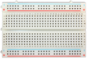||
| :--: | :--: | :--: |
|面包板专用电源模块*1|面包板*1|红色LED*1|
|| ||
|220Ω电阻*1|面包板连接线*2|电源适配器*1|

3. 元件知识：

**（1）LED**

LED是一种被称为“发光二极管”的半导体，是一种由半导体材料(硅、硒、锗等)制成的电子器件。它有正极和负极。短腿为负极，接GND，长腿为正极，接3.3V或5V。

**（2）五色环电阻**

电阻是电路中限制或调节电流流动的电子元件。左边是电阻器的外观，右边是电阻在电路中表示的符号。电阻(R)的单位为欧姆(Ω)，1 mΩ= 1000 kΩ，1kΩ= 1000Ω。

我们可以使用电阻来保护敏感组件，如LED。电阻的强度（以Ω为单位）用小色环标记在电阻器的主体上。每种颜色代表一个数字，你可以用电阻对照卡查找。

在这个套件中，我们提供了2个具有不同电阻值的五色环电阻。这里以2个五色环电阻为例：

220Ω电阻×10

1KΩ电阻×10

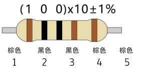

在相同的电压下，会有更小的电流和更大的电阻。电流、电压、电阻之间的联系可以用公式表示：I=U/R。在下图中，目前通过R1的电流: I = U / R = 3 V / 10 KΩ= 0.0003A= 0.3mA。

不要把电阻值很低的电阻直接连接在电源两极，这样会使电流过高而损坏电子元件。电阻是没有正负极之分。

**（3）面包板**

面包板是实验室中用于搭接电路的重要工具。面包板上有许多孔，可以插入集成电路和电阻等电路元件。熟练掌握面包板的使用方法是提高实验效率，减少实验故障出现几率的重要基础之一。下面就面包板的结构和使用方法做简单介绍。一个典型的面包板如下所示：

面包板的外观和内部结构如上图所示，常见的最小单元面包板分上、中、下三部分，上面和下面部分一般是由一行或两行的插孔构成的窄条，中间部分是由中间一条隔离凹槽和上下各5 行的插孔构成的条。

在面包板的两个窄条分别有两行插孔，两行之间是不连通的，一般是作为电源引入的通路。上方第一行标有“+”的一行有10组插孔（内部都是连通），均为正极；上方第二行标有“-”的一行有10组插孔，（内部都是连通），均为接地。面包板下方的第一行与第二行结构同上。如需用到整个面包板，通常将“+”与“+”用导线连接起来，“-”与“-”用导线连接起来。

中间部分宽条是由中间一条隔离凹槽和上下各5 行的插孔构成。在同一列中的5 个插孔是互相连通的，列和列之间以及凹槽上下部分则是不连通的。外观及结构如下图：

中间部分宽条的连接孔分为上下两部分，是面包板的主工作区，用来插接原件和面包板连接线。在同一列中的5个插孔（即a-b-c-d-e，f-g-h-i-j）是互相连通的；列和列之间以及凹槽上下部分是不连通的。在做实验的时候，通常是使用两窄一宽组成的小单元，在宽条部分搭接电路的主体部分，上面的窄条取一行做电源，下面的窄条取一行做接地。中间宽条用于连接电路，由于凹槽上下是不连通的，所以集成块一般跨插在凹槽上。

**（4）面包板专用电源模块**

说明：

这个是面包板专用电源模块，它兼容5V和3.3V， 适用于MB102面包板 。模块包含左右两路独立控制，一路通过USB供电 ，输出电压恒定为DC 5V；另一路供电DC 7-12V，输出电压由拨码开关控制，分别为DC 5V 和DC 3.3V。

如果在另一路供电DC 7-12V，当拨码开关拨到 +5V 端，模块左右两路输出电压都为DC 5V；当拨码开关拨到+3V端，模块的USB供电端输出电压为DC 5V，另一路供电DC 7-12V端输出电压为DC 3.3V。

规格：

适用：MB102面包板 

输入电压：DC7-12V或USB供电 

输出电压：3.3V、5V可切换 

最大输出电流：<700mA

左右两路独立控制，其中一路可切换为3.3V、5V 

板载两组直流输出插针，方便外部引出使用

4. 外接电源供电：

**特别注意：** 使用家庭用电。

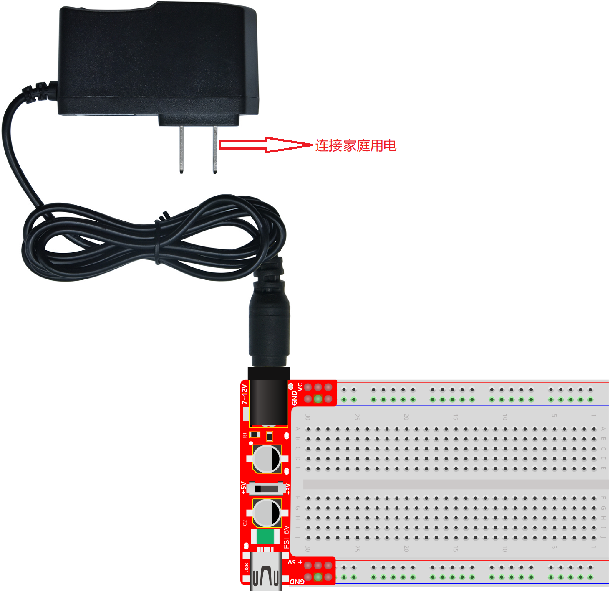

5. 项目接线图与现象：

按照接线图正确接好各元器件，外接电源供电后，将面包板专用电源模块上的**拨码开关拨到 +5V 端或 +3V 端**，如下图所示。可以看到的现象是：LED灯被点亮。

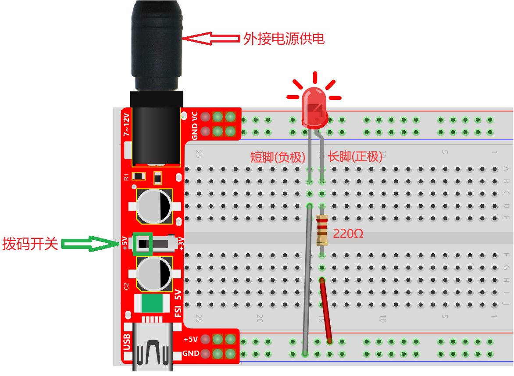

---

项目02 LED闪烁

1. 项目介绍：

在这个项目中，我们将向你展示LED闪烁效果。我们不使用任意主板，也不编程，直接使用外接电源供电使它闪烁。

2. 项目元件：

||||
| :--: | :--: | :--: |
|面包板专用电源模块*1|面包板*1|红色LED*1|
|| ||
|220Ω电阻*1|面包板连接线*2|电源适配器*1|

3. 项目接线图与现象：

按照接线图正确接好各元器件且电阻的一端通过线材连接到电源正极，外接电源供电后，将面包板专用电源模块上的**拨码开关拨到 +5V 端或 +3V 端**，如下图所示。可以看到的现象是：电路中的LED灯被点亮。

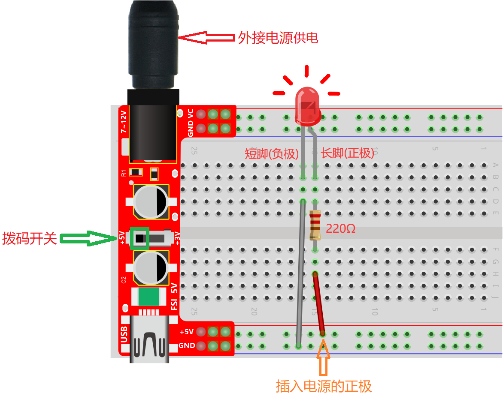

按照接线图正确接好部分各元器件且电阻的一端未通过线材连接到电源正极，外接电源供电后，将面包板专用电源模块上的**拨码开关拨到 +5V 端或 +3V 端**，将红线的一端未插入面包板的电源正极（即：没有电压电流），如下图所示。可以看到的现象是：电路中的LED灯不亮。

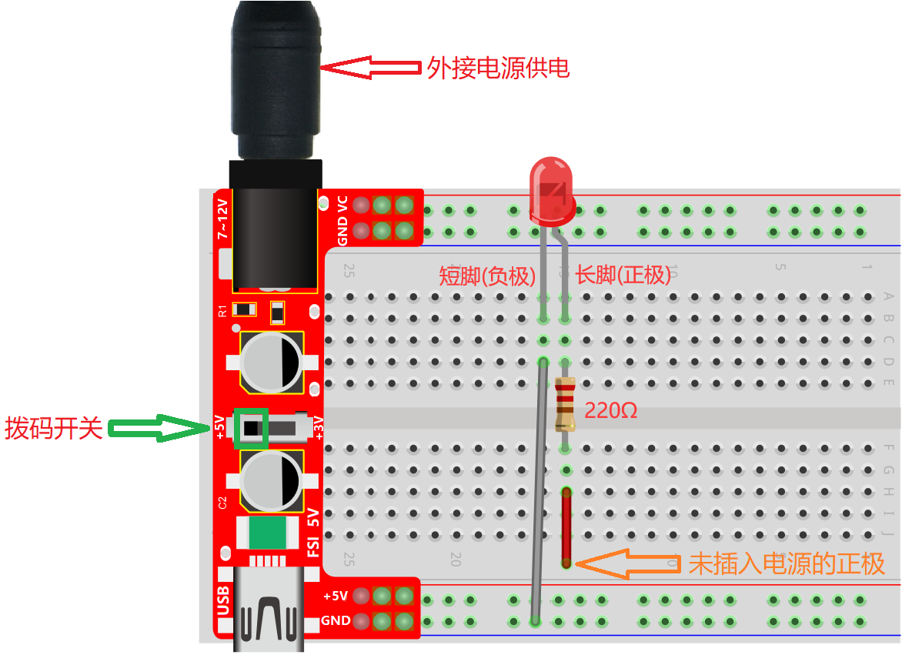

重复上面的操作，可以看到的现象是：电路中的LED不断地闪烁。

---

项目03 有源蜂鸣器

1. 项目介绍：

有源蜂鸣器模块上有一个发声元件----有源蜂鸣器。它被广泛用作电脑、打印机、报警器、电子玩具、电话、计时器等的发声元件。它有一个内在的振动源，需连接3.3V~5V电源，即可持续发出嗡嗡声。在这个项目中，我们不使用任意主板，也不编程，直接使用外接电源供电使有源蜂鸣器发出鸣叫声。

2. 项目元件：

||||||
| :--: | :--: | :--: | :--: |:--: |
|面包板专用电源模块*1|面包板*1|有源蜂鸣器模块*1|公对母杜邦线若干|电源适配器*1|

3. 元件知识：

注意：本教程使用的是有源蜂鸣器。

有源蜂鸣器和无源蜂鸣器的“源”不是指电源，而是指震荡源。

**有源蜂鸣器**：内部自带震荡源，所以一触发就能发声，发声频率固定。有源蜂鸣器的优点是程序控制方便，声压高。有源自激型蜂鸣器工作发声原理如下：直流电源输入经过振荡系统的放大和取样电路在谐振装置作用下产生声音信号。

**模块参数：**

工作电压: DC 3.3 ~ 5V 

工作温度：-10°C ~ +50°C

控制信号：数字信号

尺寸：32 mm x 23.8 mm x 12.3 mm

定位孔大小：直径为 4.8 mm

**无源蜂鸣器**: 内部不带震荡源，如果直接通直流电信号无源蜂鸣器是没有声音的，因为磁路恒定，振动膜片一直处在吸附状态，不能振动发音。根据不同需求，一般我们通过方波去驱动，然后通过更换方波的频率来实现不同音效。

**总结：有源蜂鸣器内部带震荡源，发声频率固定。无源内部不带震荡源，通过方波去驱动，发音频率可改变。**

4. 项目接线图与现象：

按照接线图正确接好模块，外接电源供电后，将面包板专用电源模块上的**拨码开关拨到 +5V 端或 +3V 端**，如下图所示。可以看到的现象是：有源蜂鸣器发出鸣叫声。

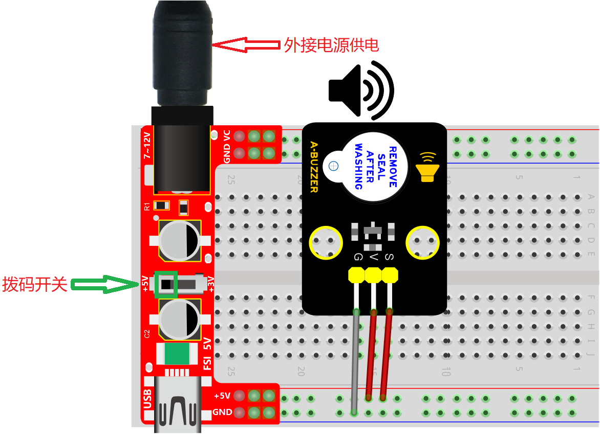

---

项目04 继电器控制LED

1. 项目介绍：

在日常生活中，我们一般使用交流来驱动电气设备，有时我们会用开关来控制电器。如果将开关直接连接到交流电路上，一旦发生漏电，人就有危险。从安全的角度考虑，我们特别设计了这款具有NO(常开)端和NC(常闭)端的继电器模块。在这节课我们将学习一个比较特殊、好用的开关，就是继电器模块，使用继电器模块控制LED灯亮灭。

2. 项目元件：

|||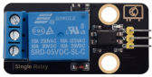|||
| :--: | :--: | :--: |:--: |:--: |
|面包板专用电源模块*1|面包板*1|继电器模块*1|红色LED*1|一字螺丝刀*1|
|||| | |
|公对母杜邦线若干|电源适配器*1|220Ω电阻*1|面包板连接线若干| |

3. 元件知识：

**继电器：** 继电器能兼容多种单片机控制板，是用小电流去控制大电流运作的一种“自动开关”。它可以让单片机控制板驱动3A以下负载，如LED灯带、直流马达、微型水泵、电磁阀可插拔式接口设计，方便使用。继电器有3个接线柱用于外接电路，分别为NO、COM和NC端（背后丝印）。

**模块参数:**

工作电压: DC 5V 

工作电流: 50 mA

最大功率: 0.25 W

控制信号: 数字信号

触电电流: 小于 3 A

工作温度：-10°C ~ +50°C

尺寸：47.6mm x 23.8mm x 19mm

定位孔大小：直径为4.8mm

**模块原理图:**

一个继电器拥有一个动触点以及两个静触点A和B。

当开关K断开时，继电器线路无电流通过，此时动触点与静触点B相接触，上半部分的电路导通。静触点B被称为常闭触点（NC）。常闭——NC（normal close）通常情况下是关合状态，即线圈未得电的情况下闭合的。

当开关K闭合时，继电器电路通过电流产生磁力，此时动触点与静触点A相接触，下半部分电路导通。静触点A被称为常开触点（NO）。常开——NO（normal open）通常情况下是断开状态，即线圈未得电的情况下断开的。

而动触点也被称为公共触点（COM）。

继电器简单来说就是一个开关，VCC表示电源正极、GND表示电源负极、IN表示信号输入脚，COM表示公共端，NC（normal close）表示常闭端，NO(normal open)表示常开端。

4. 项目接线图与现象：

 
 **特别注意：** 接线前，需要用一字螺丝刀将继电器模块的NO端口和COM端口处的螺丝扭松，将面包板连接线的一端插入NO端口和COM端口处；接好线后，再用一字螺丝刀将NO端口和COM端口处的螺丝扭紧。
 
 

按照接线图正确接好模块和各元器件且继电器模块的S引脚通过线材连接到电源正极，外接电源供电后，将面包板专用电源模块上的**拨码开关拨到 +5V 端**，如下图所示。可以看到的现象是：继电器将吸合，同时可以听到继电器吸合的声音，还可以看到继电器上的指示灯点亮，LED灯也被点亮。

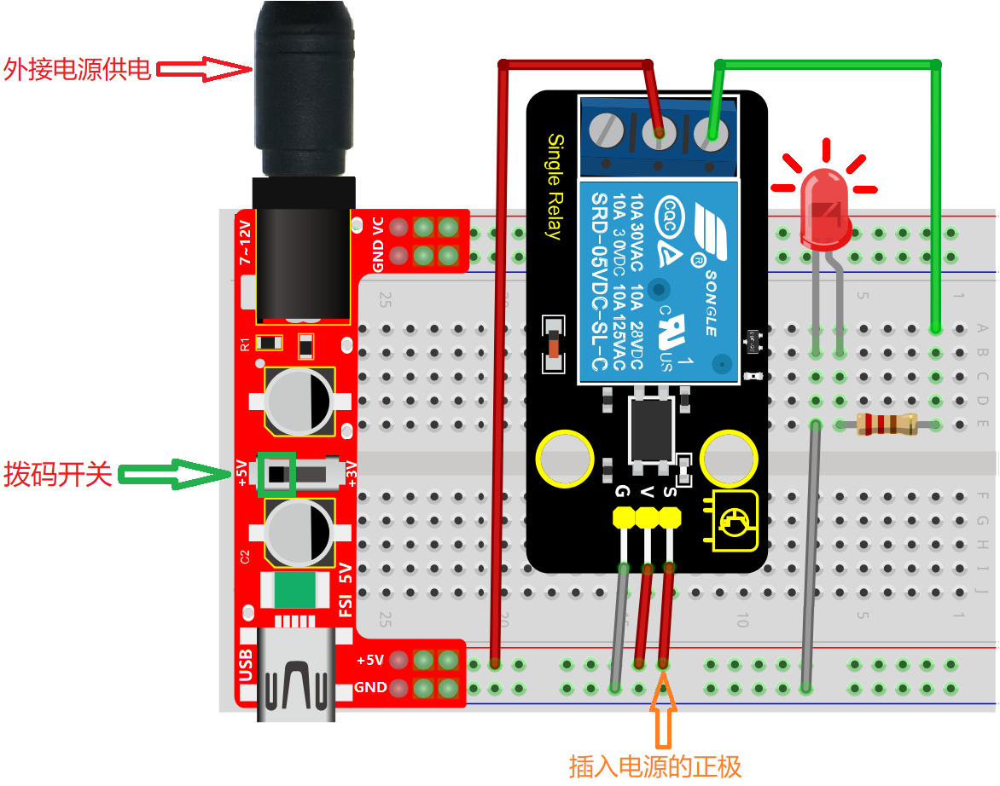

按照接线图正确接好部分线且继电器模块的S引脚未通过线材连接到电源正极，外接电源供电后，将面包板专用电源模块上的**拨码开关拨到 +5V 端**，如下图所示。可以看到的现象是：继电器将断开，同时可以听到继电器断开的声音，还可以看到继电器上的指示灯不亮，LED灯也不亮。

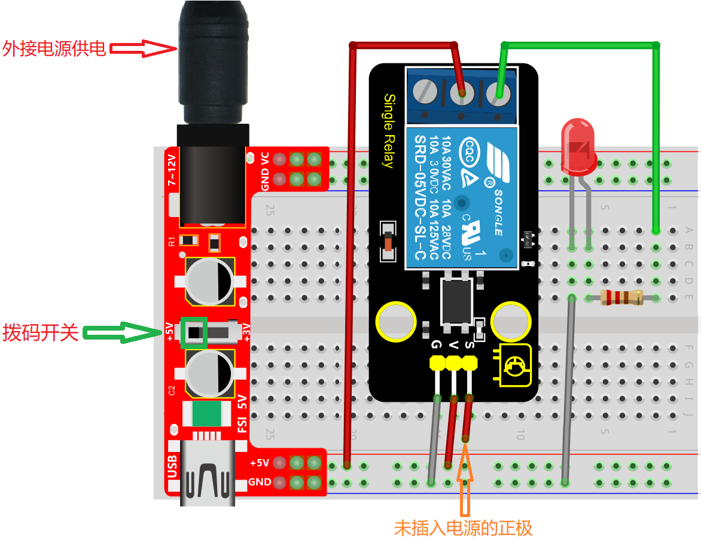

重复上面的操作，可以看到的现象是：继电器将循环吸合与断开，LED灯被点亮与熄灭。同时可以听到继电器吸合与断开的声音，还可以看到继电器上的指示灯指示状态的变化。

---

项目05 烟雾或可燃性气体控制LED

1. 项目介绍：

在本项目中，我们先学习了模拟气体(MQ-2)传感器的工作原理及相关知识，然后我们将模拟气体(MQ-2)传感器和LED灯组合实验，实现模拟气体(MQ-2)传感器检测到烟雾或可燃性气体时LED灯不亮，未检测到烟雾或可燃性气体时LED灯点亮的效果。

2. 项目元件：

||||||
| :--: | :--: | :--: |:--: |:--: |
|面包板专用电源模块*1|面包板*1|模拟气体(MQ-2)传感器模块*1|红色LED*1|一字螺丝刀*1|
|||| |   |
|公对母杜邦线若干|电源适配器*1|220Ω电阻*1|面包板连接线若干|   |

3. 元件知识：

**模拟气体(MQ-2)传感器:** 它主要用到了MQ-2 可燃气体、烟雾传感器元件。该元件所使用的气敏材料是在清新空气中电导率较低的二氧化锡(SnO2)。当传感器所处环境中存在可燃气体时，传感器的电导率随空气中可燃气体浓度的增加而增大。该传感器对液化气、丙烷、氢气的灵敏度高，对天然气和其它可燃蒸汽的检测也很理想。它可检测多种可燃性气体，是一款适合多种应用的低成本传感器。

**模块参数:**

工作电压 : DC 3.3 ~ 5V

工作电流 : 100 mA

最大功率 : 0.5 W

输出信号 ：模拟信号和数字信号

工作温度 ：-10°C ~ +50°C

尺寸 ：47.6 mm x 23.8 mm x 17.9 mm

定位孔大小：直径为 4.8 mm

**模块原理图:**

模拟气体(MQ-2)传感器与烟雾接触时，晶粒间界处的势垒受到烟雾的浓度变化而变化，就会引起表面导电率的变化。利用这一点就可以获得这种烟雾存在的信息，烟雾的浓度越大，导电率越大，输出电阻越低，则输出的模拟信号就越大。

使用时，A 端读取对应气体的模拟值；D 端连接一个LM393芯片（电压比较器），我们可以通过电位器调节测量气体报警临界点，在 D 端输出数字值。当测量气体含量超过临界点时，D 端输出低电平；测量气体含量没超过临界点时，D 端输出高电平。

4. 项目接线图与现象：

按照接线图正确接好模块和各元器件，外接电源供电后，将面包板专用电源模块上的**拨码开关拨到 +5V 端**，此时模拟气体(MQ-2)传感器上的电源指示灯点亮。旋转模拟气体(MQ-2)传感器上的电位器，微调使传感器上红色LED灯介于亮与不亮之间的**不亮**状态。如下图所示：

当传感器未检测到烟雾或可燃性气体时，如下图所示。可以看到传感器上的红色LED灯不亮，但是外接LED灯点亮。

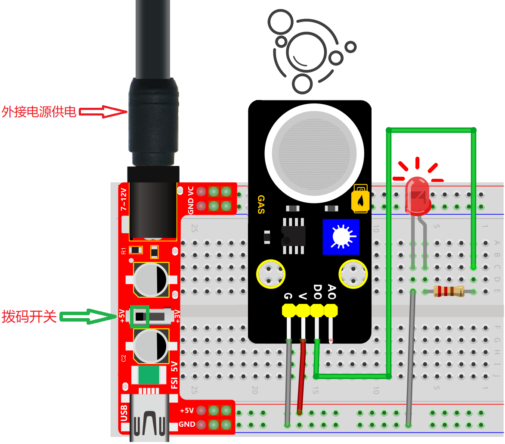

当传感器检测到烟雾或可燃性气体时，如下图所示。可以看到传感器上的红色LED灯点亮，但是外接LED灯不亮。

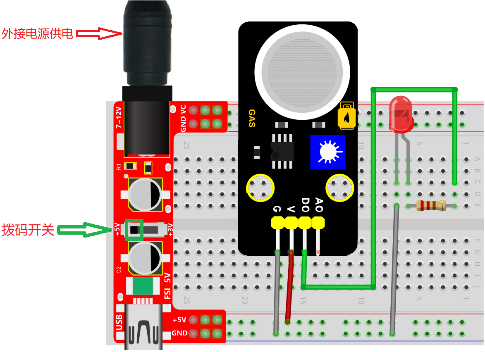

---

项目06 烟雾检测报警系统

1. 项目介绍：

前面的项目中我们已经学习了模拟气体(MQ-2)传感器的工作原理和模拟气体(MQ-2)传感器控制LED灯的效果。那么，在本项目中，我们将结合模拟气体(MQ-2)传感器、继电器模块、有源蜂鸣器模块和LED灯来模拟烟雾检测报警系统。

2. 项目元件：

|||||
| :--: | :--: | :--: |:--: |
|面包板专用电源模块*1|面包板*1|模拟气体(MQ-2)传感器模块*1|有源蜂鸣器模块*1|
|||| | 
|公对母杜邦线若干|电源适配器*1|220Ω电阻*1|面包板连接线若干| 
|||| |
|红色LED*1|继电器模块*1|一字螺丝刀*1|母对母杜邦线若干 |

3. 项目接线图与现象：

 
 **特别注意：** 接线前，需要用一字螺丝刀将继电器模块的NO端口和COM端口处的螺丝扭松，将面包板连接线的一端插入NC端口和COM端口处；接好线后，再用一字螺丝刀将NC端口和COM端口处的螺丝扭紧。
 
 

按照接线图正确接好模块和各元器件，外接电源供电后，将面包板专用电源模块上的**拨码开关拨到 +5V 端**，如下图所示。看到的现象是：当模拟气体(MQ-2)传感器检测到烟雾或可燃性气体时，可以看到继电器上的指示灯熄灭，同时有源蜂鸣器发出警报，外接LED灯也被点亮。

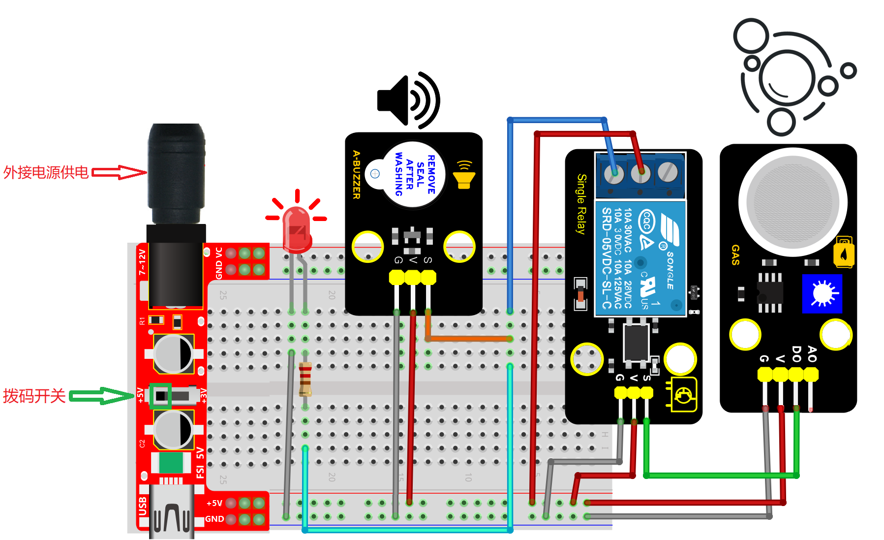

---

